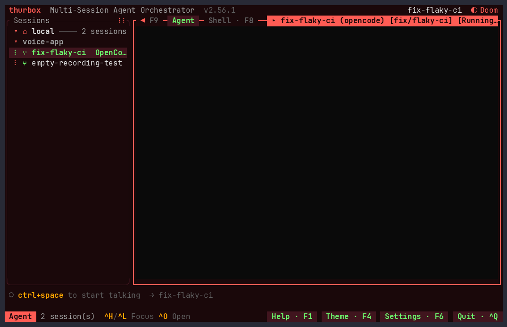
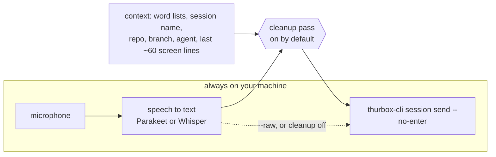

# thurbox-voice

Dictate prompts into [thurbox](https://github.com/Thurbeen/thurbox) sessions.
Press `ctrl+space`, talk, press it again: the text lands in the selected
session's input box, **unsubmitted**, for you to read and send. Speech is
transcribed on your machine; the audio never leaves it.



<sub>A real take, re-recorded with [`demo/record.sh`](demo/record.sh): thurbox
v2.56.1 on Linux, Parakeet, cleanup off. The voice is espeak-ng, played into a
virtual microphone, so the take is the same every run.</sub>

**Status: early.** It works end to end; expect rough edges.

## Set it up

You need thurbox **v2.56.0 or later**, Rust, and `cmake` (whisper.cpp builds
with it: `brew install cmake` on macOS). On Linux the audio crate also needs
`pkg-config` and the ALSA headers (`libasound2-dev`, or `alsa-lib` on Arch).

```bash
# 1. The helper, and the default speech model (671 MB)
git clone https://github.com/TMSCH/thurbox-voice && cd thurbox-voice
cargo install --locked --path crates/thurbox-voice
thurbox-voice pull parakeet

# 2. The pane
thurbox-cli plugin install git+https://github.com/TMSCH/thurbox-voice
thurbox-cli plugin check
```

3. **Let it run the helper.** In thurbox: `Ctrl+,` → `]` → select `voice` →
   `t`. Until then the strip says `voice needs trust`.
4. **Placement is automatic.** The pane is a *strip*, and thurbox's shipped
   layout puts strips above the bars on its own: two rows, the voice line and a
   gap. If your `~/.config/thurbox/ui/layout.lua` is customised and predates
   strips, `thurbox-cli plugin check` says so. Add this once, before the
   message band (`if status_rows() > 0 then`):

   ```lua
   for _, strip in ipairs(ctx.strips or {}) do
     children[#children + 1] = { slot = strip.slot, len = strip.len }
   end
   ```

The helper always runs on the machine running thurbox, where the microphone
is, even when the session lives on a remote host.

## Use it

| Strip | Means |
|---|---|
| `○ ctrl+space to start talking → fix-ci` | idle; the arrow names the selected session |
| `● REC 0:07 → fix-ci · parakeet · ctrl+space to stop` | recording for that session |
| `⋯ transcribing for fix-ci…` | speech to text, then cleanup |
| `✓ dictated 66 chars → fix-ci — review, then Enter` | in the input box, not sent |

The session is fixed when you start: change the selection mid-sentence and the
text still goes where you started. Nothing is ever submitted for you.

- **Palette** (`Ctrl+P`): `voice: cancel the recording`,
  `voice: switch speech engine`.
- **Settings** (`Ctrl+,`): `voice.engine`, `parakeet` or `whisper`.

## Engines

| Engine | Model | Download | Licence |
|---|---|---|---|
| `parakeet` (default) | NVIDIA Parakeet TDT 0.6B v3, int8 ONNX, 25 languages | 671 MB | CC-BY-4.0 |
| `whisper` | OpenAI Whisper large-v3-turbo, q5_0 GGML, 99 languages (Metal on macOS) | 574 MB | MIT |

`thurbox-voice pull whisper` adds the second one. Models are pinned to a
Hugging Face revision and checked against a SHA-256. They live under
`$THURBOX_VOICE_HOME`, else `$XDG_DATA_HOME/thurbox-voice`, else
`~/.local/share/thurbox-voice`.

## What leaves your machine



- **Audio never does.** Recording and transcription are local.
- **Text can.** The cleanup pass gives the transcript, plus the context above,
  to a language model that fixes misheard words ("cargo next test" →
  `cargo nextest`). That model is hosted unless you point it at a local
  server. `backend = "auto"` follows the session's agent: for `claude`, the
  Anthropic API if `ANTHROPIC_API_KEY` or `ANTHROPIC_AUTH_TOKEN` is set, else
  `[cleanup.agent] command` if set, else `claude -p` on your existing login;
  for `codex`, `[cleanup.openai]` if configured, else that command or
  `codex exec`. For any other agent it tries those two APIs, then that
  command or the agent's own CLI, then the first of `claude`, `codex`,
  `gemini`, `opencode` on `PATH`. **If the choice fails, `auto` tries each of
  those installed CLIs in turn**, all of them hosted.
- **To keep text local**, turn cleanup off, or point it at an
  OpenAI-compatible server on your machine (Ollama, LM Studio, llama.cpp)
  *with `backend = "openai"`*: under `auto`, a local server that is down
  hands the text to the next backend.

```toml
# ~/.config/thurbox-voice/config.toml — `thurbox-voice config` prints the path
# and the configured backend.
[cleanup]
enabled = false           # paste the raw transcript

# …or keep it on, locally:
# backend = "openai"
# [cleanup.openai]
# model = "your-model-id"
# base_url = "http://localhost:11434/v1"
```

The cleanup model only corrects words. If its output drifts too far from the
transcript (length or shared words), it is refused and the raw transcript is
pasted instead; if no backend answers at all, the raw transcript is pasted too.

### Cleanup configuration

```toml
[cleanup]
enabled = true
backend = "auto"            # "auto" | "anthropic" | "openai" | "agent"

[cleanup.anthropic]         # key from ANTHROPIC_API_KEY, or ANTHROPIC_AUTH_TOKEN
model = "claude-haiku-5-5"  # the default; the Messages API needs an exact id

[cleanup.openai]            # any OpenAI-compatible endpoint
model = "your-model-id"
base_url = "https://api.openai.com/v1"
api_key_env = "OPENAI_API_KEY"   # not needed for a local base_url

[cleanup.agent]             # a headless agent CLI, on its own login
codex_model = "luna"        # a family, resolved against Codex's catalog
# command = ["my-agent", "-p"]   # or your own; the prompt is appended

[context]
glossary = ["Spotpay", "payouts", "ledger"]   # your own words
```

The agent presets start each CLI lean: `claude -p --model haiku` with settings,
tools and MCP servers switched off, or `codex exec` with a Luna model from
Codex's catalog at low effort. Context is a built-in word list (`thurbox`,
`tmux`, `worktree`, `Claude Code`, `nextest`, …), your glossary, and the target
session as `thurbox-cli` reports it. Whisper is also primed with the word
lists.

## Behind the key

A daemon holds the microphone and the loaded model. `start` records from the
default input through cpal; `stop` resamples to 16 kHz mono, trims silence,
transcribes, runs the cleanup pass and pastes. It exits after
`[voice] unload_after_secs` seconds idle (default 600, at least 30), which
frees the model's memory. The pane only calls
`thurbox-voice start/stop/cancel`; `status` and `quit` are there too.

```bash
thurbox-voice models                     # what is installed
thurbox-voice test                       # talk, press Enter, see text and timings
thurbox-voice test --save clip.wav       # keep the recording…
thurbox-voice test --file clip.wav --engine parakeet --engine whisper   # …and compare engines
thurbox-voice cleanup --agent codex "run cargo next test"   # cleanup alone, no audio
thurbox-voice stats                      # median load, inference and cleanup times
```

- **`the microphone delivered pure silence`**: on macOS the permission prompt
  is for your *terminal app*, not for thurbox-voice. Allow it in System
  Settings › Privacy & Security › Microphone and restart the terminal.
- **Logs** are in the data directory: `daemon.log` for the daemon, and
  `compare.jsonl` with every transcription's engine, audio length, timings and
  text.

## Re-recording the demo

[`demo/record.sh`](demo/record.sh) drives the installed thurbox and helper in a
throwaway profile: its own config, data, tmux socket and `HOME`, with this
checkout's plugin trusted and two opencode sessions. The microphone is a
private PipeWire source that the script plays an espeak-ng sentence into, so
no real microphone is opened. The script fails rather than render a step that
did not happen: it waits for each strip state and checks that the target
session shows the text. It needs Linux with PipeWire, asciinema 2.x and agg;
the header lists the rest.

## Attribution

Parakeet TDT 0.6B v3 © NVIDIA, licensed under
[CC-BY-4.0](https://huggingface.co/nvidia/parakeet-tdt-0.6b-v3). The ONNX
export is by [istupakov](https://huggingface.co/istupakov/parakeet-tdt-0.6b-v3-onnx).
Whisper © OpenAI, [MIT](https://github.com/openai/whisper). Engines are run
through [transcribe-rs](https://github.com/cjpais/transcribe-rs).
